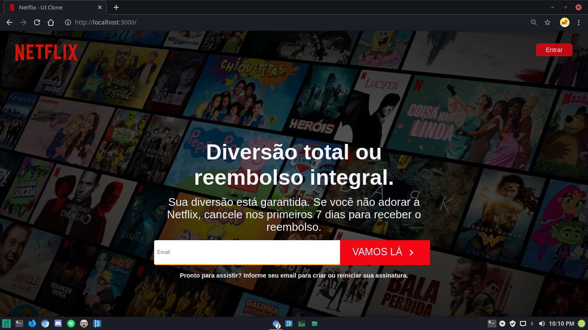

<h1 align="center">Welcome to Netflix UI 👋</h1>
<p>
  
  <a href="https://github.com/userAugustos/Netflix-UI" target="_blank">
    
  </a>
  <a href="#" target="_blank">
    
  </a>
  <a href="https://twitter.com/userAugustos" target="_blank">
    
  </a>
</p>

> A netflix UI clone, with styled-components



## Install

```sh
npm install
```

## Usage

```sh
npm start
```

## Run tests

```sh
npm run test
```

## Author

👤 **Felipe Augustos**

* Twitter: [@userAugustos](https://twitter.com/userAugustos)
* Github: [@userAugustos](https://github.com/userAugustos)

## Show your support

Give a ⭐️ if you like this project!
